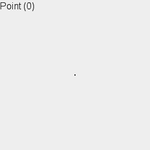

# Wrapping your head into Fourth dimension

Fourth dimension in the nutshell is a new direction that always perpendicular to all direction in our 3D world. To avoid misconception, the *fourth dimension* that we use in this term are the fourth dimension in four dimensional euclidean space, not in the minkowski space-time!

## Starting point

There are lot online websites explaining four-dimensional objects in detail. Have a look for these websites:

+ [eusebeia.dyndns.org](http://eusebeia.dyndns.org/4d/)

> [!NOTE]
> This section does only cover information and concepts that specific to the library. We'll assume you have reading websites that has been linked above.

## Everything Upgradable

The author of the library believes in `Everything is Upgradable`, means that anything that works in three or lower dimension can be implented in 
higher dimension, such as 4D.

A very simple example can be inferred from the popular 4D shape *tesseract*, which is an upgrade from a *cube*, which is an upgrade from a *square*, and so on.

*image from [wikipedia](https://en.wikipedia.org/wiki/File:From_Point_to_Tesseract_(Looped_Version).gif)*
